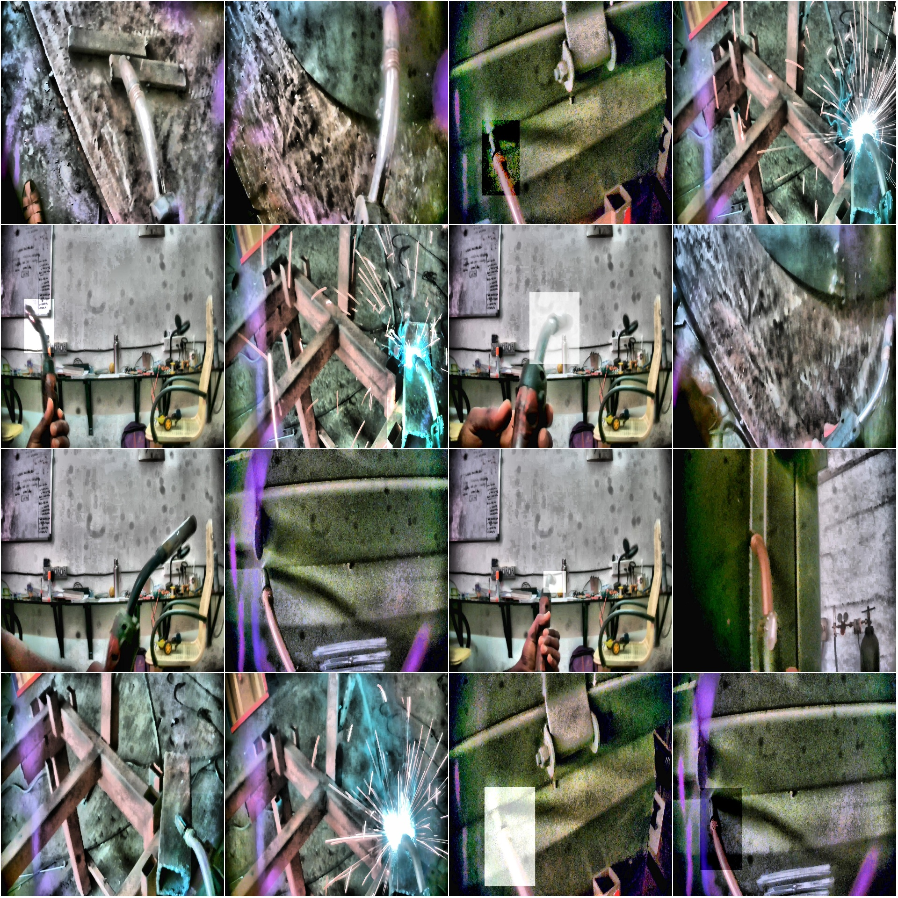
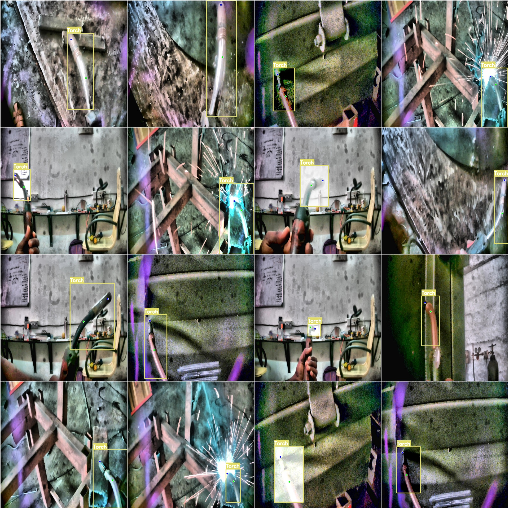

# Detector Pose Keypoints Dataset - YOLO V2

## Key Points Detection for Welding Gun Pose in YOLO format

### Dataset Format:
- **Key Point Format** (Note: This is not the YOLO format for object detection or segmentation, it merely contains JPG images along with corresponding YOLO format TXT files)

### Image Count:
- Number of JPG files: 1730
- Number of TXT files: 1730

### Training Set:
- Number of training images: 1182

### Validation Set:
- Number of validation images: 342

### Test Set:
- Number of test images: 206

### Number of Categories:
- Number of categories: 1

### Category Name:
- 'Welding Gun'

### Number of Key Points per Category:
- Torch box count = 1732
- Total box count = 1732

### Image Resolution:
- 1280x1280

### Important Note:
- The dataset has been predefined for training with models like Yolov5-Pose or Yolov8-Pose or Yolov11-Pose or Yolov26-Pose.
- No guarantees are made regarding the accuracy of the trained model or weight files.

### Image Preview:
- [Example Images (Randomly selected 16)]
- [Annotation Results]

## Images

Here is a pay link on Stripe ( https://buy.stripe.com/3cs8yP7sY87d0vu9AB ). Please contact me lonlonago@foxmail.com after funding $89, and I will send you a complete data files , thank you!

